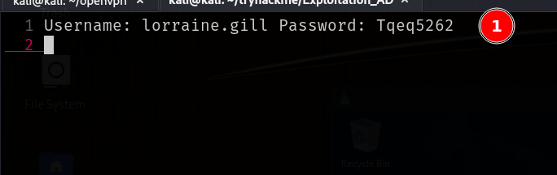
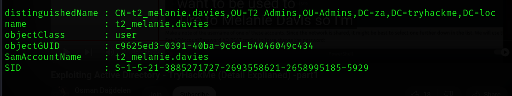
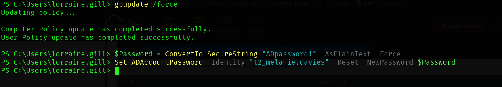
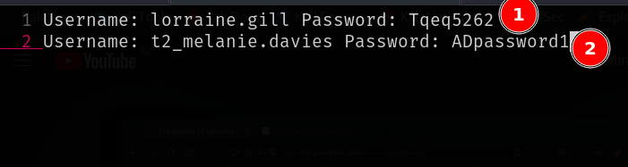
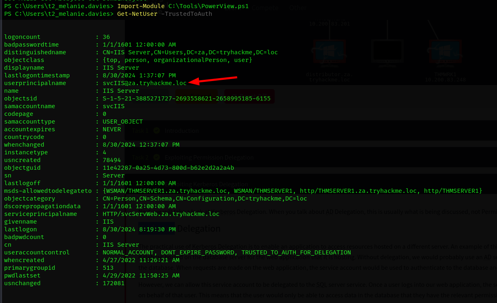
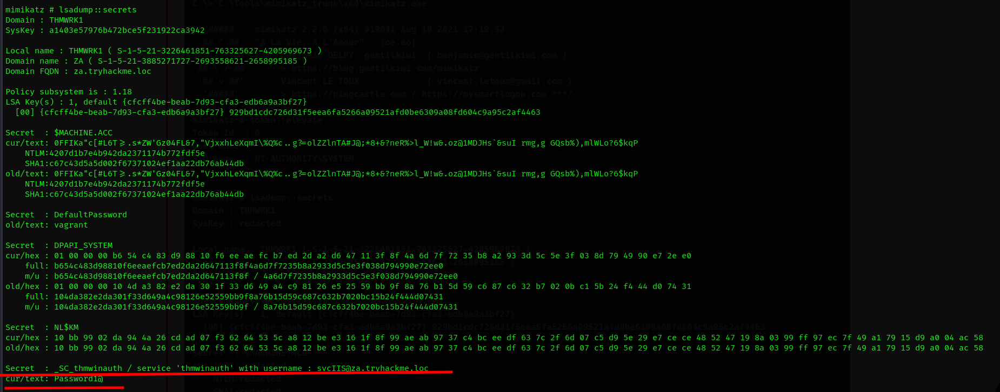
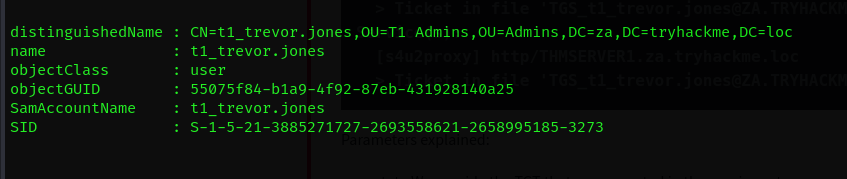
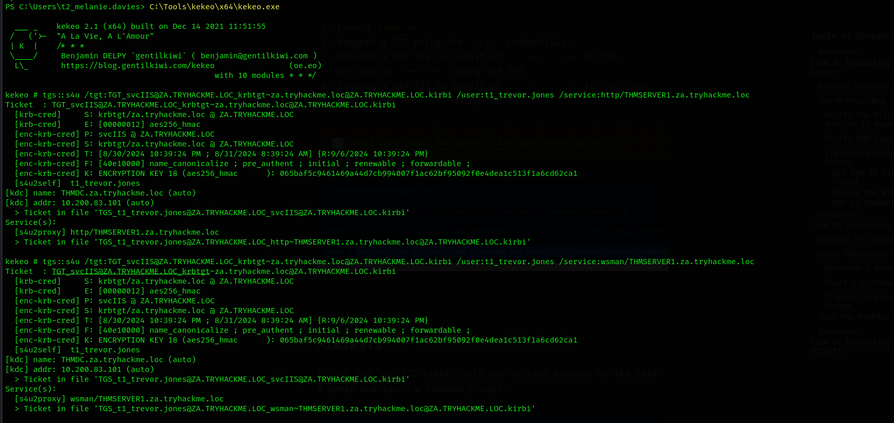
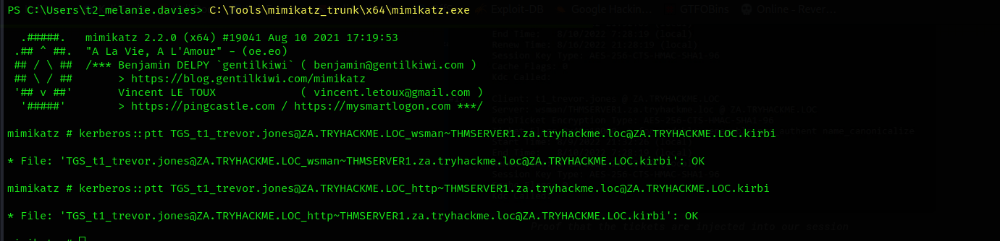

## First step: Logging in

```bash
xfreerdp /u:lorraine.gill /p:Tqeq5262 /cert:ignore /v:10.200.83.248
```


#### The First Creds




### Adding my account to IT

I added my self to the IT Support Group.


And then Validating it...


### Escalating in the IT

```bash
Get-ADGroupMember -Identity "Tier 2 Admins"
```

This is my target:



And After a lots of REFRESHING AND PANICKING NOT TO WORK, it worked...



And Done...


### Second Cred



---

## Kerberos 


Looking up, and it's an interesting find to see that this user can delegate `WSMAN/THMSERVER1.za.tryhackme.loc` and `http/THMSERVER1.za.tryhackme.loc`, so it is a free access to `winrm` on `THMSERVER1`



### Dumping The Secrets

#### `mimikatz`
```powershell
C:\Tools\mimikatz_trunk\x64\mimikatz.exe
```

and Getting the secrets with `lsadump`...



Now searching for a `tier 1`
```powershell
Get-ADGroupMember -Identity "Tier 1 Admins"
```

The Target..



Getting the `TGT` and the the `TGS`



Injecting The Ticket into the session...



