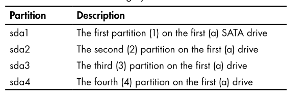

This chapter talks about how the file system on the Linux works, and how we mount drives on various Linux File-systems.


## The Device Directory *`/dev`*

As said before in these notes every thing in the Linux system is a file, on that even the devices connected to the OS is represented in files and controlled by editing and writing into a file.

**`/dev`** is the path that contains all the files related to the devices connected to to your device.

### External Drives from the `/dev`

This is an `ls -la /dev` result:

```R
~ ❯ ll /dev
Permissions      Size User Date Modified Name
crw-------     10,116 root 19 Apr 21:33  acpi_thermal_rel
crw-r--r--     10,235 root 19 Apr 21:33  autofs
drwxr-xr-x          - root 19 Apr 21:33  block
drwxr-xr-x          - root 19 Apr 21:33  bsg
crw-rw----     10,234 root 19 Apr 21:33  btrfs-control
drwxr-xr-x          - root 19 Apr 21:33  bus
drwxr-xr-x          - root 19 Apr 21:34  char
crw-------        5,1 root 19 Apr 21:33  console
lrwxrwxrwx          - root 19 Apr 21:33  core -> /proc/kcore
drwxr-xr-x          - root 19 Apr 21:33  cpu
crw-------     10,122 root 19 Apr 21:33  cpu_dma_latency
crw-------     10,203 root 19 Apr 21:33  cuse
brw-rw----        8,0 root 19 Apr 21:33  sda  <------
brw-rw----        8,1 root 19 Apr 21:33  sda1 <---------
brw-rw----        8,2 root 19 Apr 21:33  sda2 <-----------
brw-rw----       8,16 root 19 Apr 21:33  sdb  <-------------
```

The `sda`, `sda1`, `sda2`, `sdb` paths are the paths of the hard disk and it's partitions, and the external storage sources like a USB flash drive.

### How Linux Represents Storage Devices?

#### Drives Labels

***"Linux uses logical labels for drives that are then mounted on the filesystem.
These logical labels will vary depending on where the drives are mounted,
meaning the same hard drive might have different labels at different times,
depending on where and when it’s mounted."*** 

#### History

In the good old days Linux systems used to label the "Floppy disks" as `fd`, and the non-SATA hard drives as `hda`, while the new SATA interfaces are labeled with `sd`

#### Incrementing labeling method

When systems have more than one hard drive, Linux simply names
them serially by incrementing the last letter in alphabetical order, like `sda`, `sdb`, `sdc` and so on...


The **Partitions** is labeled by the label of the disk + the number of the partition.



#### Checking the drives

In case know you want to check the drives that you save in your `/dev` file you may want to use `fdisk` command.

##### `fdisk` Utility

`fdisk` is a utility in Linux that helps to manage the drive by creating, deleting, managing the partitions, and showing the info of your disk. 

Viewing the partitions can be done by this command : `sudo fdisk -l`, and the `sudo` permissions is for accessing the ***root*** branched `/dev` path.

The Output of  `fdisk -l`:

```R
~ ❯ sudo fdisk -l
[sudo] password for XXXXXX:
Disk /dev/sda: 931.51 GiB, 1000204886016 bytes, 1953525168 sectors
Disk model: WDC  WDS100T2B0A
Units: sectors of 1 * 512 = 512 bytes
Sector size (logical/physical): 512 bytes / 512 bytes
I/O size (minimum/optimal): 512 bytes / 512 bytes
Disklabel type: gpt
Disk identifier: 6FF4CB70-8D78-4684-9AA6-773AF73F7B72

Device       Start        End    Sectors   Size Type
/dev/sda1     2048    2099199    2097152     1G EFI System
/dev/sda2  2099200 1953523119 1951423920 930.5G Linux root (x86-64)

Device       Start       End      Sectors  Size  Type
/dev/sdb1     32     320123312    321234455 28.8G HPFS/NTFS/exFAT   

Disk /dev/zram0: 7.81 GiB, 8388608000 bytes, 2048000 sectors
Units: sectors of 1 * 4096 = 4096 bytes
Sector size (logical/physical): 4096 bytes / 4096 bytes
I/O size (minimum/optimal): 4096 bytes / 4096 bytes
```

That shows the size of each partition and the size of the whole disk, while the size of `zram` is the size of the swap memory.

The `/dev/sdb1` is the Flash drive, and the ***b*** in the label says it is the second drive labeled after the system hard drive. Note that `fdisk` indicates that it is an `HPFS/NTFS/ExFAT` file system type.
These file types High Performance File System (`HPFS`), New Technology File System
(`NTFS`), and Extended File Allocation Table (`exFAT`) are not native to Linux systems but rather to `macOS` and Windows systems.

##### File system types

The file system types differentiate from the windows to the Linux. The file system types decides how to store, how to retrieve the data on and from the hard.

- Windows: `NTFS`
- Linux: FAT, BTRFS, EXT3, EXT2


