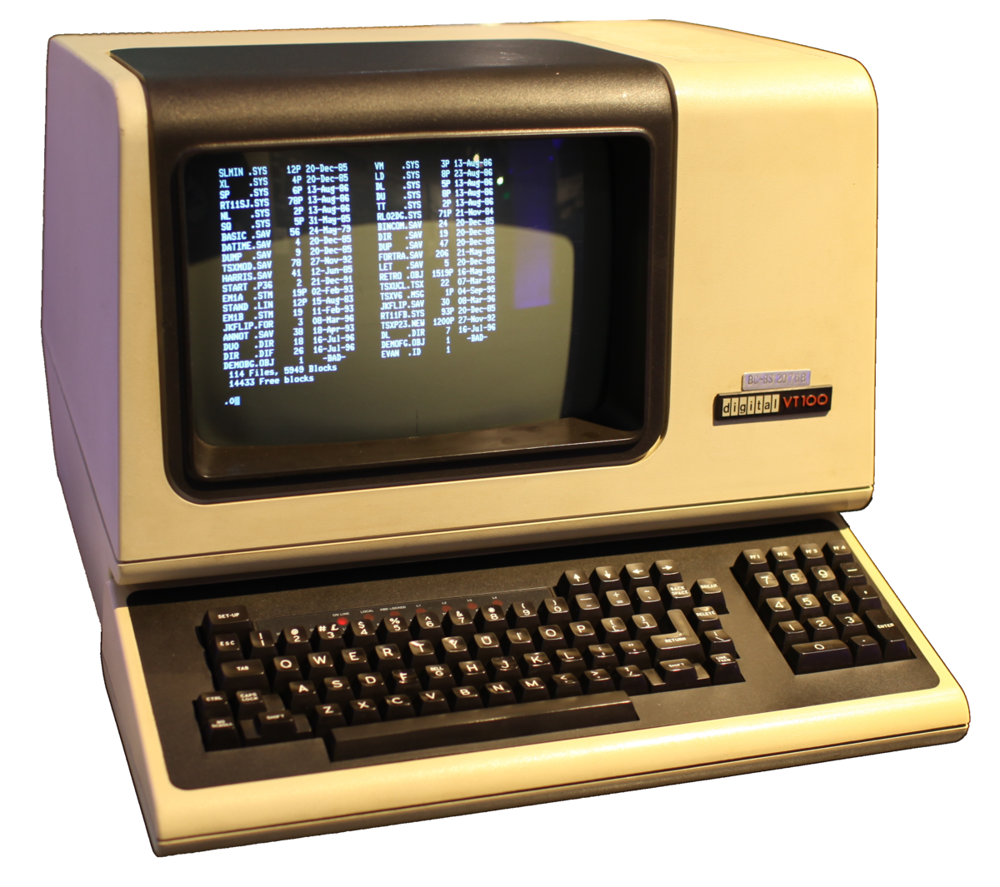
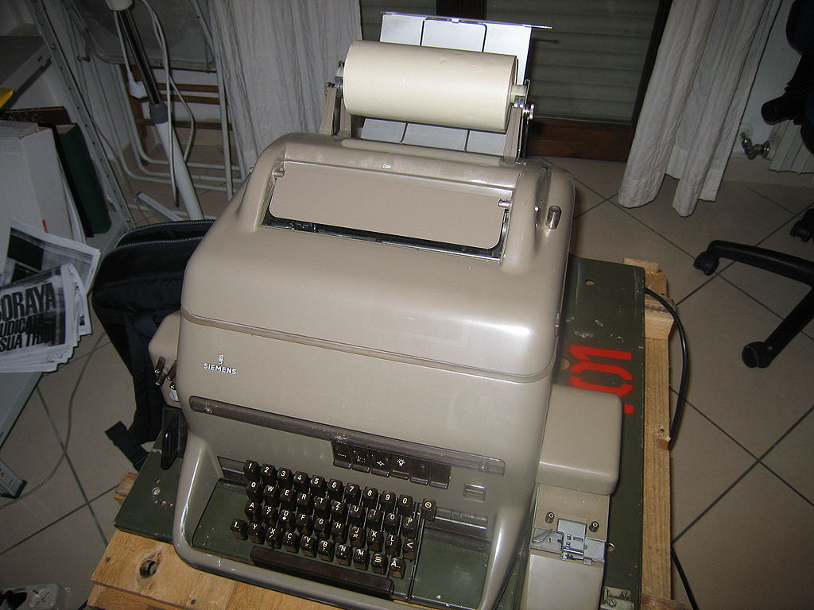
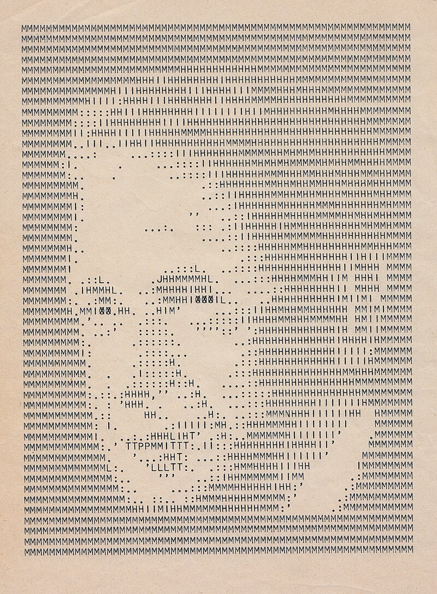
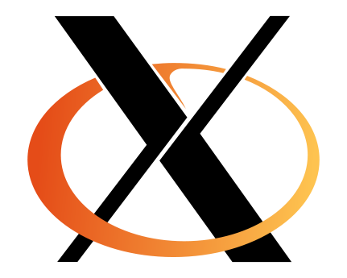

---
tags:
  - bash
  - script
  - tty
  - pty
  - IP
  - X
  - X11
  - Xorg
---
##### sources might help you: 
-[Terminal and CLI art](https://youtu.be/KdoaiGTIBY4?si=r-ikK2oqcvU_1clK)
- [What is tty](https://www.youtube.com/watch?v=N1bz1DTD8Io)
- [Using a 1930 Teletype as a Linux Terminal](https://www.youtube.com/watch?v=2XLZ4Z8LpEE&t=509s)
- [tty and Xwindows](https://www.feyrer.de/NetBSD/ttys.html)
- [`X System`](https://www.youtube.com/watch?v=R-N-fgKWYGU&list=LL&index=1&t=1084s)
---

Okay, let's ask some questions:
1. what is `BASH`
2. what is `terminal`
3. what is `shell`
4. what is `tty`
5. what is `pty`
6. what is `X Windows`

And i know that questions isn't in the book, but that is my notes and that is what i asked while reading the book, So, before i get into the bash scripting i am saying all what i searched for about: What is the terminal?

## Intro

The operating system, the fellow who helps you to use the hardware of your potato PC needed a hand to help to get a long with the hardware, he needed someone to translate your programs and commands into processes and manage them this is when the `Kernel` comes in, but we also needed the mutual ground to send the commands through between us and the kernel, that is when the `shell` came in.

I already saw a lot about the making of `UNIX` and i suggest you this [documentary](https://www.youtube.com/watch?v=tc4ROCJYbm0) it is about the UNIX system, Dennis Ritchie and Ken Thompson are there, it is amazing.

The thing is i already knew that the operating system have a shell to send the commands to the kernel of the operating system, and i saw the weird, vintage looking terminals in the documentary i mentioned above, late after that i also knew `multics` which inspired the duo (Dennis Ritchie and Ken Thompson) to make the `UNIX`, and i saw after that the old mainframe which all the terminals access it and throw the commands in it which made me ask a new question, what is this terminal and how it works?
and i knew that it was made after another invention which is the `tty` -don't feel confused i will explain all of them after my loud thinking-, and i also noticed that there are a thing on the Linux also called `tty`, and in another branched research of all of these, i wanted to know how the graphical terminals works so i also saw another weird word which is `pty`.
Forgive me for this loud thinking, but i wanted to give a full pictures of my journey and steps of knowing a crucial thing like how a shell like the bash works? and after all i made this firstly for my future me to preserve this steps and titles for him.

## What is Bash

The first question i asked, and the answer is: (Bourne again Shell), it is a shell programmed by the [GNU](https://en.wikipedia.org/wiki/GNU)project which is made as an open source alternative for the Bourne Shell that was made for the UNIX system, in those old days -i mean 1980s- the GNU project made the BASH for the UNIX Like Systems and made a lot of other amazing open source projects that is necessary to run in your daily use of Linux, Unix Like systems and even some of them taken to Windows, and the GNU was made by Richard Stallman.

So the bash is a program in the system that you can run the commands on and when we try to give it a name describes how it works we say that it is a shell.

## What is Shell

The Shell is a command line interpreter, it is the main user interface to talk with the system.

It takes every command you give and translates it into a process that the kernel might understands it and manage.

It executes programs by just typing the name of it, interact with the file system and create processes.

The first modern shell made was made for UNIX and the name of it was [Thompson Shell](https://en.wikipedia.org/wiki/Thompson_shell) and it was introduced at the first released version of UNIX at 1970 !!!

Before the shell was made there was another form of the command interpreters we see today which is was the [CTSS](https://en.wikipedia.org/wiki/Compatible_Time-Sharing_System), it was made to share give a command input to a mainframe -a large computer in the old days- from a peripheral device -which is a terminal- connected to the mainframe and get the output from the mainframe as soon as the process end it was based on synchronization and made the old computers look interactive till Thompson came and rolled the table.

## What is the Terminal ?

Originally the terminal was a device, in our early days it is just a window, both were made to take our key types and translate it into characters which makes a command, and display the output of the response of the command we made by the shell on the computer.

##### A GPT definition of it:
- A **terminal** originally referred to a physical device (like a keyboard and display) used to interact with a computer. In the modern context, a terminal is often a command-line interface (`CLI`) environment that lets you interact with the shell. 

**In the the good old days**, the terminal was not a computer, as i said it was a peripheral of a bigger computer like a mainframe. The terminal has a keyboard to translate each character you want to type to ASCII code to write a command you desire, and a display CRT screen to see the what you type and what is the result of your command, so it was the window that you access the shell of the OS that runs on the mainframe and that OS manages terminals sessions.

So simply keystrokes types commands, commands get output, output displayed on a display platform which is the CRT screen, it needed a whole device to make this small functions, to make more than one person uses the computers in the old days, but those small functions were also made in another more older device called `tty`.


## What is `tty` ?



A **teleprinter** (**teletypewriter**, **teletype** or **`TTY`**) is an [electromechanical](https://en.wikipedia.org/wiki/Electromechanical "Electromechanical") device that can be used to send and receive typed messages through various communications channels, in both [point-to-point](https://en.wikipedia.org/wiki/Point-to-point_(telecommunications) "Point-to-point (telecommunications)") and [point-to-multipoint](https://en.wikipedia.org/wiki/Point-to-multipoint_communication "Point-to-multipoint communication") configurations. ([WIKIPEDIA](https://en.wikipedia.org/wiki/Teleprinter))

It was a mechanical or some times electrical device, which was used to send messages and each character had its own code, and to receive a message and print it, so it was a sender receiver, encoder decoder, mechanical or electrical device to communicate and it was very  old that it was used to communicate in the World War 2 and invented even before it.
It even had it's own art, which developed on our days to the ASCII art:

> Example of teleprinter art: a portrait of [Dag Hammarskjöld](https://en.wikipedia.org/wiki/Dag_Hammarskj%C3%B6ld "Dag Hammarskjöld"), 1962

#### So why the `tty` is related to Linux?

In a direct way, no there are no relation between the old teletypewriters and the modern Linux in a way or or another, but it was an old concept of the development of what we see today, the old terminals were a modern teletypewriters but with CRT display and electrical keyboards which were working by a world unified code which is the ASCII, and then when the era of the mainframes became to an end -i know it didn't end and still there are mainframes but they are so rare to use and they are all in IBM- there was another type of computers got to the stage which were the small computers, less computing power and storage but small, the keyboard and CRT are embedded into the device, there were still mainframes, but the new small computers by IBM made a new way to use the computers. So the OS is working now on just one computer, the computer and the terminal were in the same device were the same hardware, and i think from this point in the 1970s -late in specific-, the terminals switched to be a software.

## The modern use of the word `tty`

Let's just ignore the phase that made terminals switch to be a software component in UNIX and other operating systems in 80s and 90s, and let's go to what we use, and see what we live in now. The terminal remained in the OS as a device but logically, in Linux there is a Virtual Terminal, which is defined on the system as a device that takes keystrokes and do some actions on the display, just a text only screen, you write and take your output on it.

The Linux have main 7 Virtual terminals or `tty` or terminal teletypes, you can switch between them with `CTRL`+`ALT`+`F1` (Function keys), The first one for your display manager, the second is for your DE or WM and the reset are spare, and there are more than 7 `tty` on Linux and it differs from distro to another how they are used.

So imagine that with me we are now on a personal IBM small computer on the mid of 80s, and we have UNIX which is the famous operating system back then, and we have a virtual devices that acts like terminals on our system and they are a tex based, the question is: how all that graphics and GUI came if we all -till now- in the background live on a text based virtually emulated 60s  command prompt device?

The answer is the 2 words: `pty`, `X windows`

## What is `X Window` ?



This is the Godfather of the modern GUI i searched a lot of the mechanism of how the `X Window` system, and how it works but i didn't get how actually it is working behind scenes just had some conflicting thoughts might be right or wrong, so i will just give a surface look about what is the `X window` and what it does, and to find a good article to give you some info look at this [article](https://www.feyrer.de/NetBSD/ttys.html) i will talk based on it.

The `X window` is a graphical protocol that controls the `tty` screen and draws upon it a graphical interface. The `X window` is used on the UNIX and UNIX-Like systems from 80s till now!

The X Window System, developed at MIT in the mid-1980s, revolutionized how graphical interfaces are presented on Unix-based systems. Initially, Unix operated on a purely text-based interface, where users interacted through teletypes and CRT terminals connected via serial lines. Commands were sent to a central mainframe, with responses displayed character by character. The need for a more intuitive user experience led to the development of the X Window System, which decoupled the graphical interface from the hardware.

In the context of the X Window System, "networks" refers to the capability of X to operate in a distributed environment. This means that the X server (the component that manages the display and input devices) can run on one machine while the X clients (the applications that use the graphical interface) can run on different machines connected through a network. 

X is designed to allow applications (clients) to be executed on one machine while their graphical output is displayed on another machine. This architecture is particularly useful in networked environments, enabling remote access to graphical applications, so when you have a terminal that supports the `X system` and you want to access a GUI app, the `X server` runs and treats you as an `X client` and give you the a processed graphical output of the application you want.

So to be clear and simple, the `X window` system which is in the modern Linux systems called `XOrg` or `X11` are a protocol that controls the `tty` screen, and by communicating with the frame buffer and a lot of other things and other protocols it directly access the hardware and use it to draw your screen pixel by pixel, and in the front end it has special protocols to communicate with the programs with libraries like `GTK` or `QT` to define a mutual ground with the apps to communicate with them for making the GUI.

## What is `pty`

The X Window System and `PTY`s (pseudo-terminals) both serve as interfaces for user interaction in Unix-like systems, but they operate at different layers. `PTY`s emulate physical terminals, providing bidirectional communication between processes (such as shells) and terminal emulators. X Window, on the other hand, manages graphical output and input devices, allowing applications to display windows and receive input via keyboard and mouse. While `PTY`s enable text-based I/O over virtual terminals, X manages graphical sessions. X clients (applications) can interact with remote or local X servers, while `PTY`s facilitate terminal-based interactions within those environments.

In the X Window System, a PTY (pseudoterminal) provides an interface that mimics a physical terminal, enabling terminal emulators like `xterm` to interact with processes. A PTY has two components: the master (controlled by the emulator) and the slave (seen as a terminal by applications). When a user types, input goes from the emulator through the master side to the slave, where it's processed like terminal input. Output from the application is sent back through the master, displayed by the emulator. PTYs allow terminal-based applications to function within graphical environments like X.

## The End

Now, after answering all the questions i asked, after explaining all what i researched and read as i can in those previous notes, after knowing -partially- how this Terminal screen on the system works and the shell on it, now i am satisfied to start talking about the book topic.

---

# What is BASH and what is Scripting

A shell is an interface between the user and the operating system for running commands and managing files directly, without a GUI. Linux offers various shells like Korn, Z shell, C shell, and Bash (Bourne-again shell).

Writing a script is a skill that every hacker must have. **Scripts** most of the times are made to automate some repetitive commands, because of that often the used languages for scripting are interpreted high-level languages (like python, java script, bash). **Bash** is a shell that gives you the ability to communicate with the system, and the commands of it is ran by an interpreter, so it gives you the ability to run a script of the commands of this shell on that interpreter.

# Writing a script

## The Shebang!

First line of the BASH script is to indicate that you want to use the BASH interpreter binary to run the script, to do that there you need to to type the shebang (`#!`) followed by the path of the bash binary on the system (`/bin/bash`)

```bash
#! /bin/bash
# The Shebang
```

knowing that it is okay to use the shebang method for any other interpreted language like python for example.

The Shebang must be in the first line and nothing before it not even a comment.

## Write, Executebash
# The Shebang


Now the next point is to add a function to the script to see it working. I will make it say hello world and get the content of the desktop.

```bash
#! /bin/bash
# The Shebang

#print hello world
echo "Hello World"

#print the content of the Desktop
ls ls "/home/$USER/Desktop"
```

The `$USER` is an **environment** **variable** the contains the name of the user running the script on his shell. To revise on environment variables go to [Chapter 7](Ch7_Environment_Variables.md)

---
