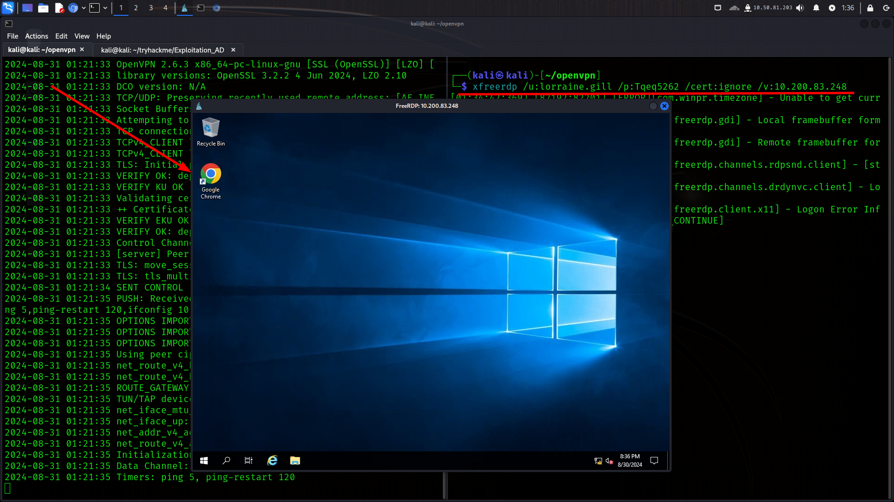
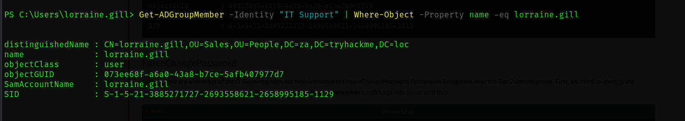
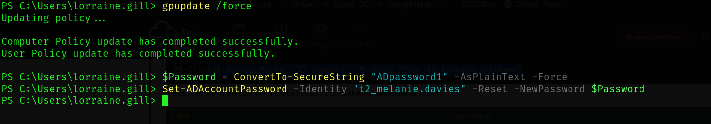
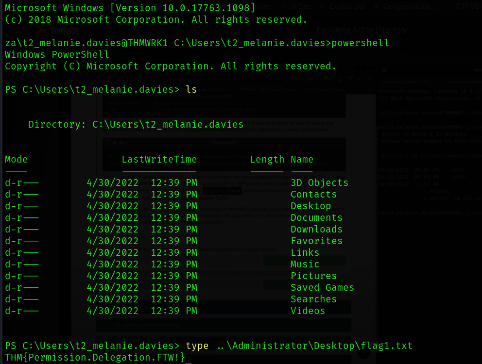

## First step: Logging in

```bash
xfreerdp /u:lorraine.gill /p:Tqeq5262 /cert:ignore /v:10.200.83.248
```



#### The First Creds


### Adding my account to IT

I added my self to the IT Support Group.


And then Validating it...


### Escalating in the IT

```bash
Get-ADGroupMember -Identity "Tier 2 Admins"
```

This is my target:


And After a lots of REFRESHING AND PANICKING NOT TO WORK, it worked...


And Done...



---
