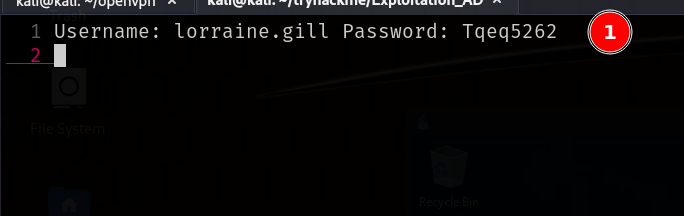
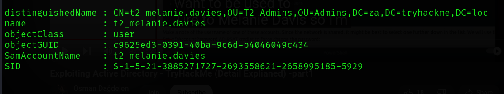
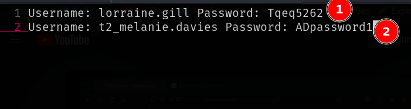
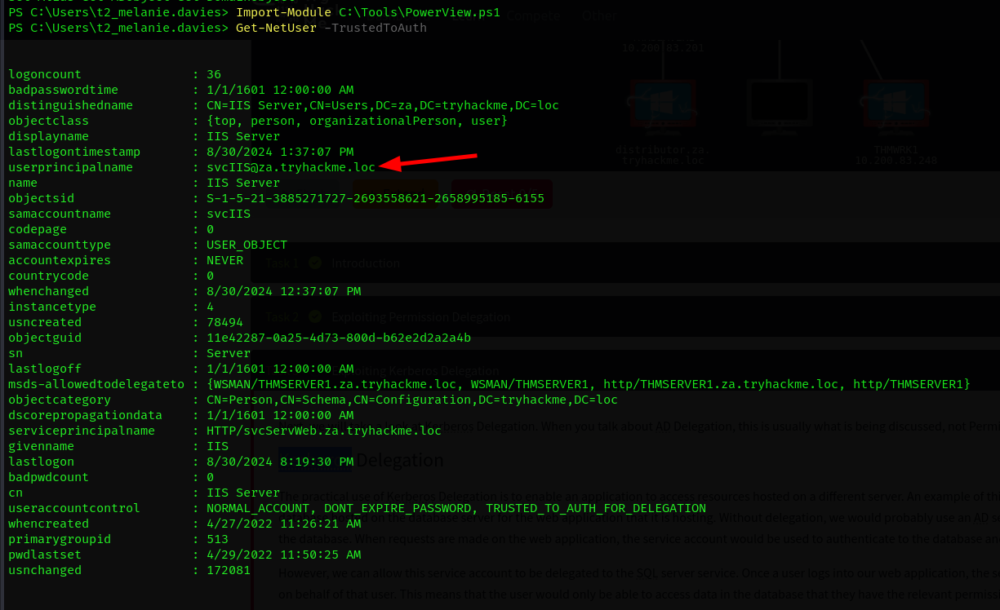

## First step: Logging in

```bash
xfreerdp /u:lorraine.gill /p:Tqeq5262 /cert:ignore /v:10.200.83.248
```


#### The First Creds




### Adding my account to IT

I added my self to the IT Support Group.


And then Validating it...


### Escalating in the IT

```bash
Get-ADGroupMember -Identity "Tier 2 Admins"
```

This is my target:


And After a lots of REFRESHING AND PANICKING NOT TO WORK, it worked...


And Done...


### Second Cred


---

## Kerberos 

Looking up, and it's an interisting find to see that this user can delegate `WSMAN/THMSERVER1.za.tryhackme.loc` and `http/THMSERVER1.za.tryhackme.loc`




