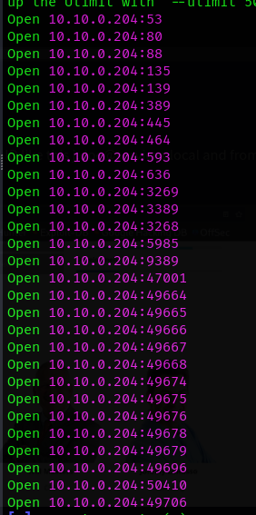
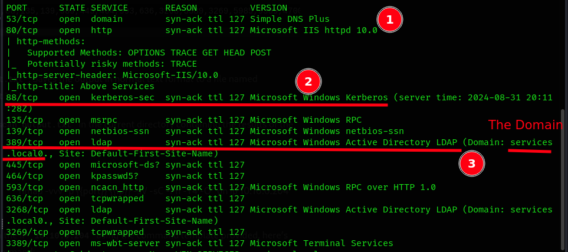

# Scanning

### Open ports
**The first part** in the scanning is to find the open ports. I used `Rustscan` to find them.



### `Nmap`

```bash
sudo nmap -p 53,80,88,135,139,389,445,464,593,636,3268,3389,3269,5985,9389,47001,49664,49666,49667,49665,49668,49674,49675,49676,49678,49679,49696,49706 -vvv -sV -sC -Pn -T4 -O -oN nmap 10.10.0.204
```


Some interesting things in the scan..



#### I put the `nmap` scan results on this [file](../../files/nmap_tryhackme_room_services.txt)
