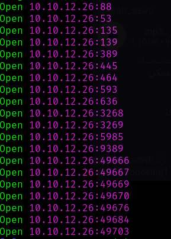
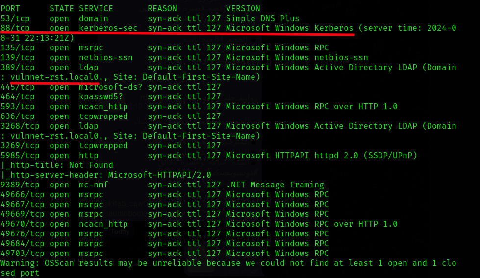
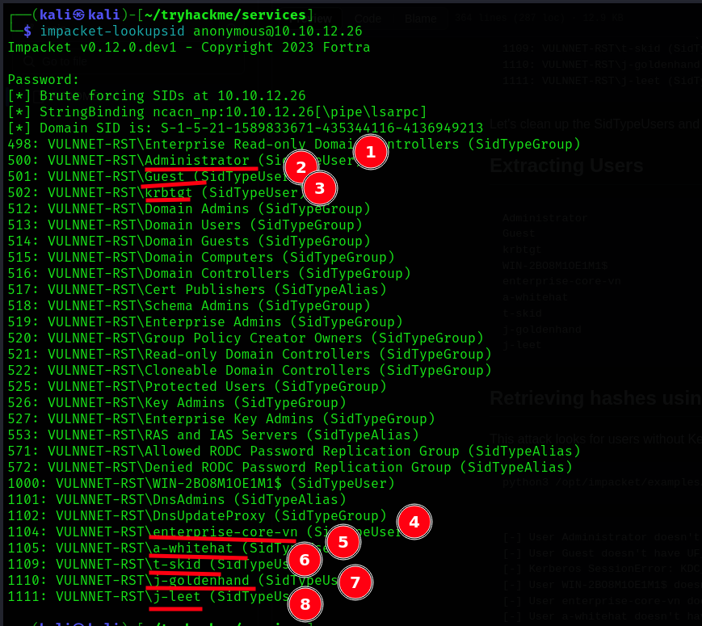
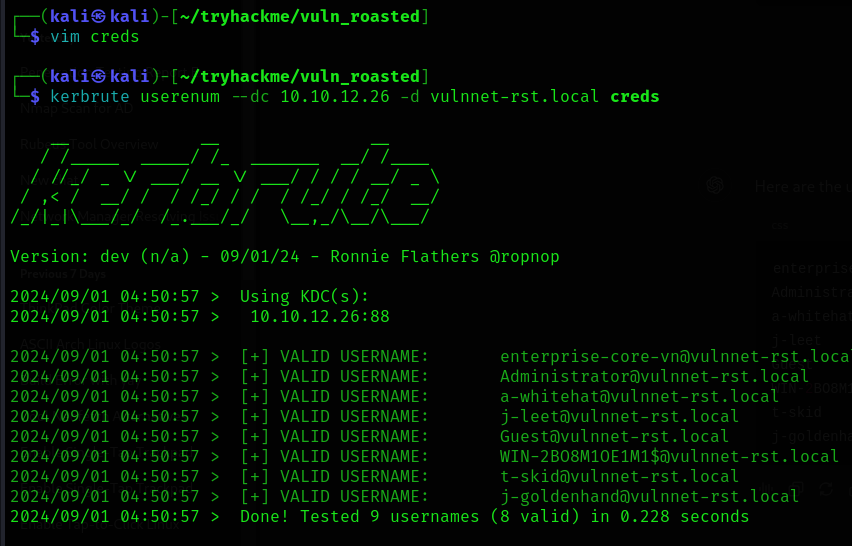
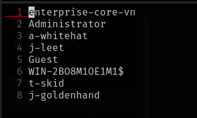
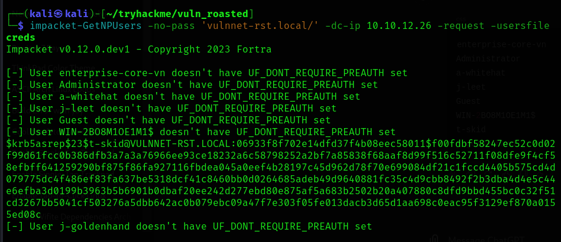

# Scanning

### Scanning on the open ports



A `kerberos` and the Domain will work on 

 and the `nmap` report file is [here](../../files/vuln_roasted/nmap.txt)

---

### Enumerating 

There is no users list so doing a users `SID` dumping might be useful in this case, it might get some users in the domain

```bash
impacket-lookupsid anonymous@10.10.12.26 
```



**Succeeded!**

Now let's make a list and test on `kerbrute` ..



Now the valid users are:



Trying to get the hash from the usernames and the bingo goes to `t-skid`


