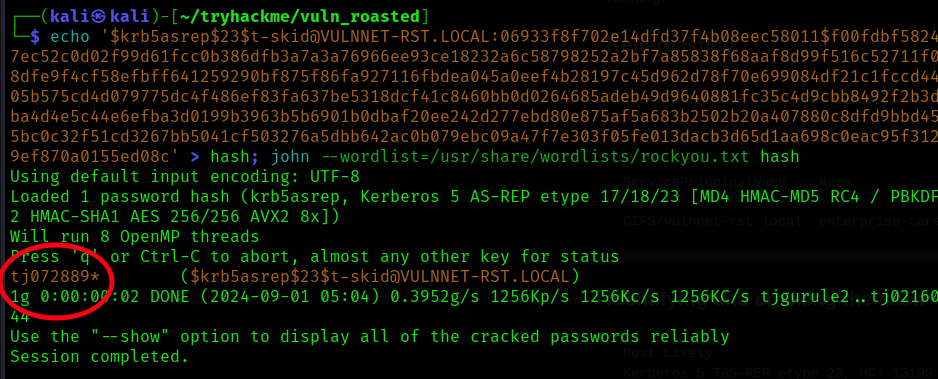
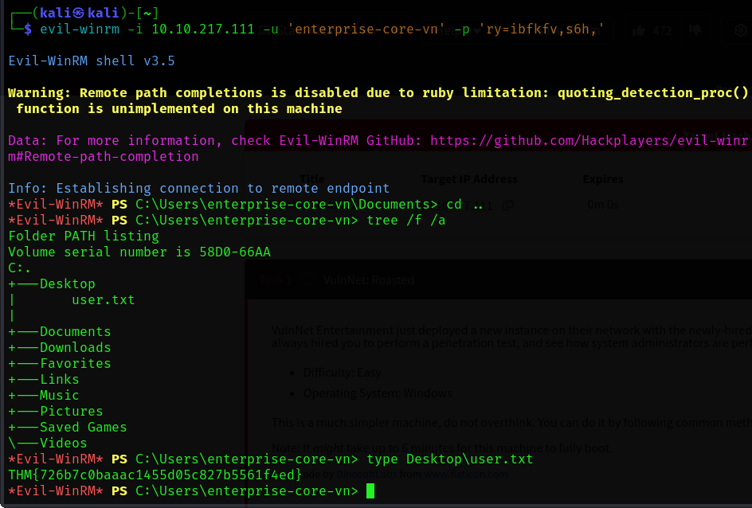
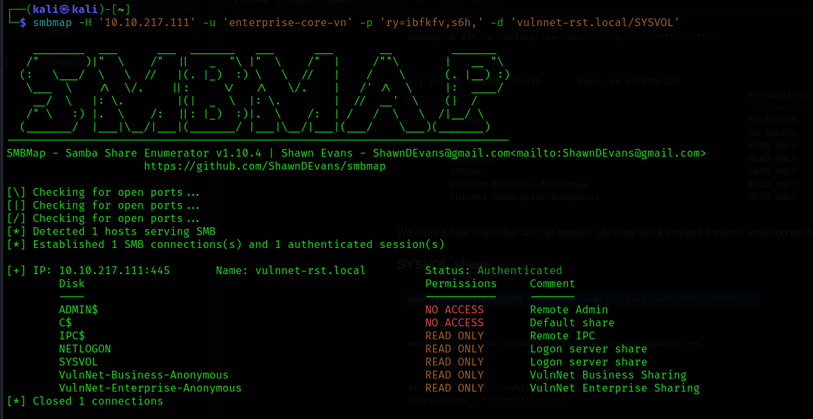

# Scanning

### Scanning on the open ports


A `kerberos` and the Domain will work on 

 and the `nmap` report file is [here](../../files/vuln_roasted/nmap.txt)

---

### Enumerating 

There is no users list so doing a users `SID` dumping might be useful in this case, it might get some users in the domain

```bash
impacket-lookupsid anonymous@10.10.12.26 
```


**Succeeded!**

Now let's make a list and test on `kerbrute` ..


Now the valid users are:


Trying to get the hash from the usernames and the bingo goes to `t-skid`


Cracking with `john` ...


And now it is `Kerberoasting` time to look if we can get a `TGS`
```bash
impacket-GetUserSPNs -dc-ip 10.10.12.26 'vulnnet-rst.local/t-skid:tj072889*' -outputfile khash
```

Luckily we got one for `enterprise-core-vn`, and by cracking it with john that would be the pass
 

And.. I'am in and got the flag.....



Now There is no further more progress we can achieve in this session so let's map the `smb` using `smbmab` looking for further info to escalate.



Now the `SYSVOL` in the `smb` is a marked directory to access, so let's get into it


