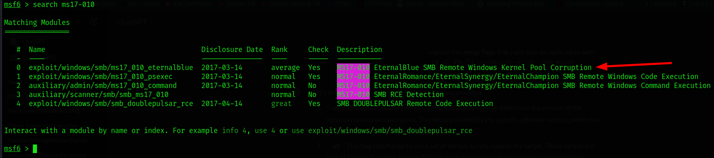
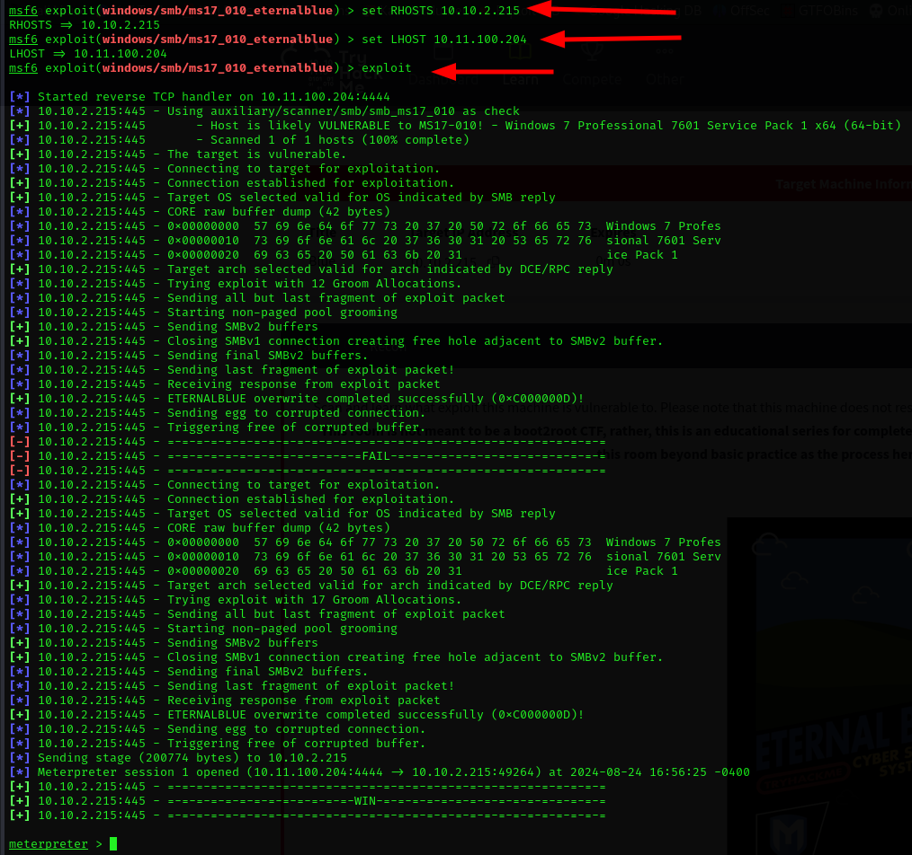
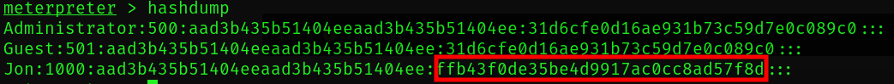
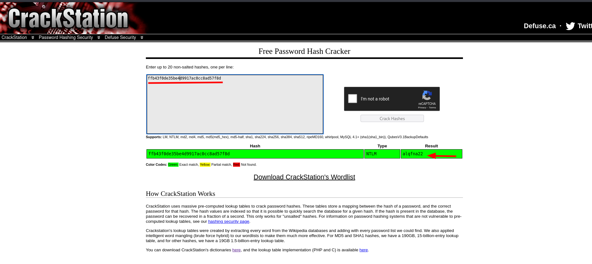
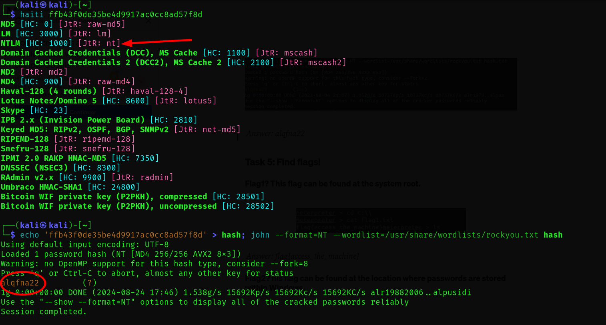
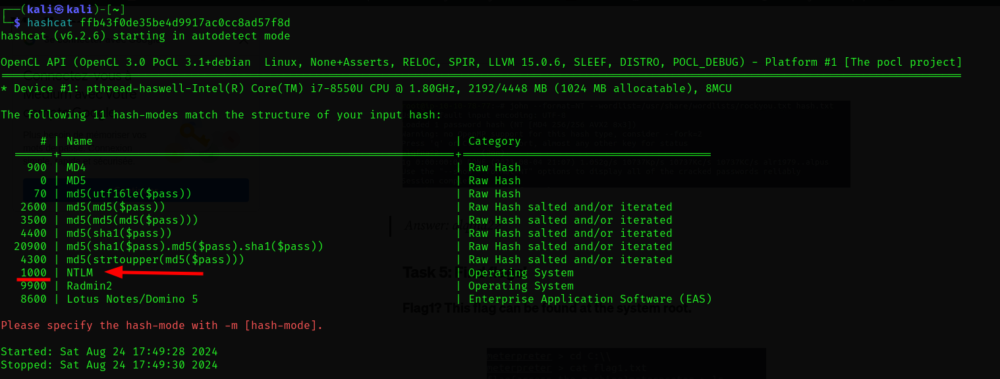
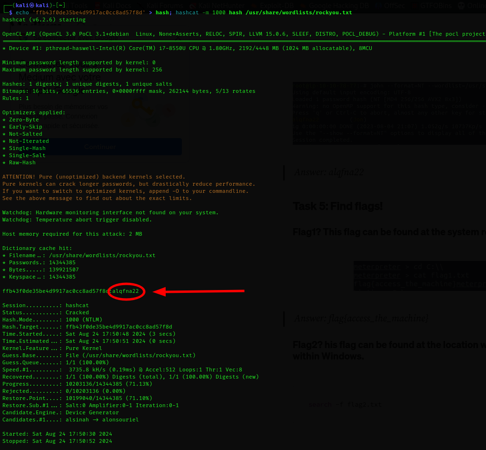

---
tags:
  - windows
  - blue
  - metasploit
  - nmap
  - exploit
---
`Link: https://tryhackme.com/r/room/blue

---

# Scanning...

First thing First, let's do the `nmap` scan to detect the open ports and the services.


##### Let's break through the flags...

1. `-p-`  this is for scanning all the ports, note that you might choose a range with this format: `-p 1-80` or choose a specific ports with this format: `-p 22,80`
2. `-sV` is for scanning the versions of the services on this ports
3. `-sC` it is the default scripts run by the `NSE` it saves a lot of time running them manually
4. `-- script=vuln` here I am choosing a script that searches for vulns and their exploits on services on the scanned ports
5. `10.10.2.215` basically the IP :)

#### After the scan done 😴


The `vuln` script found a vulnerability of a remote code execution....


---

# `Metasploit`

Let's search with the name of it on the `msfconsole`....



Then enter this: `use 0`

Now let's set the parameters and hit exploit..
of course you will enter in `LHOST` your IP on `tryhackeme`, and `RHOSTS` is the machine IP and here I am counting on that the `SMB` is on the default port which is `445`



#### Now take a break to answer task 1 and task 2 based on all the previous.

---

# Escalate

This task is easy and repetitive to things above, the thing to consider in this task is the command `ps` and the command `migrate` which makes you migrate you session from a process to another to maintain it and keep it from antiviruses, try those commands and search about them.

---
# Cracking

To get the hashes of the password on the machine we will use the command `hashdump`, this will lead us to a non default user called `Jon` and his password's hash



Which we can crack with 2 or three ways:
1. [Crack Station](https://crackstation.net/)
   Just paste the hashes you got and let him crack
   
2. John The Ripper which i mentioned in [LinuxRoom-1](../../THM_CTF/LinuxRoom-1.md)
   Knowing that we are on windows and on an eternal blue old machine the hash type would be `NTLM`, and by cracking it with `john` and `rockyou` we will get the password
   
3. `hashcat` which is a tool to identify and crack the hashes
	- So first let's identify the hash and get the number of it on the hash cat list
	     
	 - lets crack it..
		   

##### Give the answers to `tryhackme` and let's continue

---

# Flags

**Flag 1,2** are easy just on the `Meterpreter` hit this command:
```bash
search -f flag1.txt
```

and take the path of path the files and see them with `cat` and that's it.

**Flag 3** the hint might make interested to look at the `c:\\Users\\` directory, might also make you search into Jon's files, or just hit `search -f flag3.txt` in the directory 😅