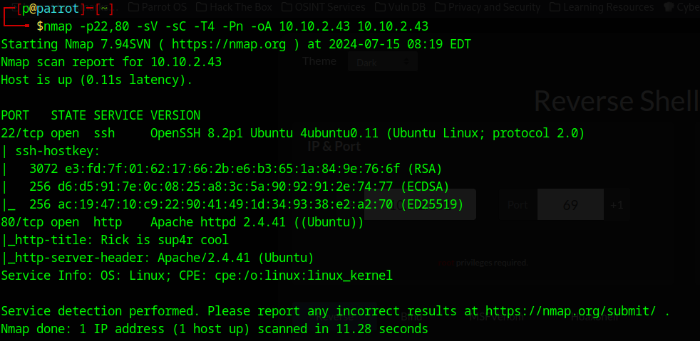
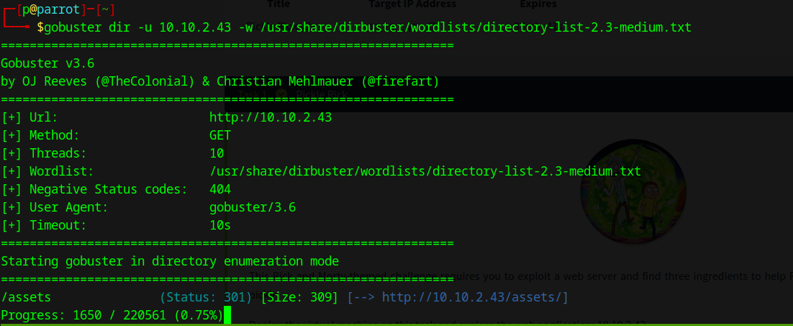
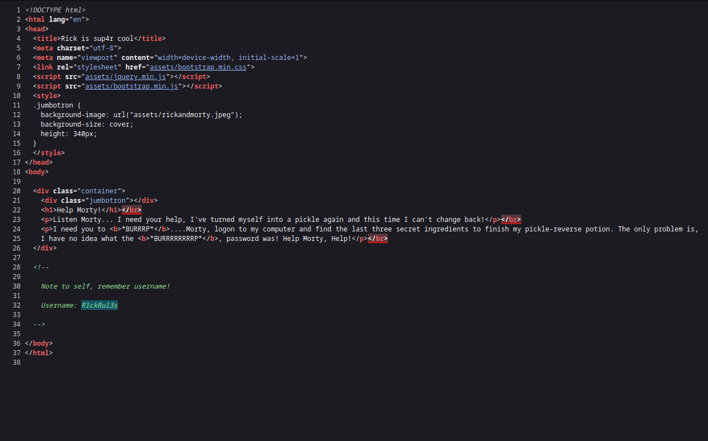
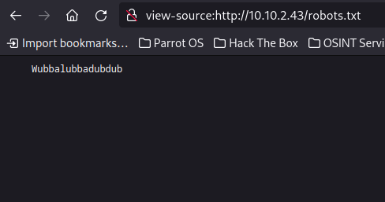

---
tags:
  - less
  - cd
  - grep
  - web
  - directories
  - nmap
  - gobuster
---
Link:https://tryhackme.com/r/room/picklerick
Writ-ups:
- https://whokilleddb.medium.com/tryhackme-pickle-rick-walkthrough-2c33bf07c77b
- https://infosecwriteups.com/try-hack-me-pickle-rick-walkthrough-f3378114dd7a

---

This machine is an easy one.

### Getting the scans done


#### Scanning with `nmap`

```bash
nmap -p22,80 -sV -sC -T4 -Pn -oA {IP}
```


#### Scanning with `gobuster`
```bash
gobuster dir -u 10.10.2.43 -w /usr/share/dirbuster/wordlists/directory-list-2.3-medium.txt
```
 

---

### Getting to the site directories

While searching in the source of the home page we will find a username for login
	 
While trying to look for something in `robots.txt` file you will find the password, ironically it's `wubbalubbadabadab`
	

Enter the directory of the login page `/login.php` and get to the portal


### The commands field

This command field directly executes commands on Ricks computer, So let's open a reverse shell with python -Note that you can get the code of the reverse shell from [revshell](https://www.revshells.com/)

#### The last thing

check the `home` and the `root` and the first directory you are logged in.