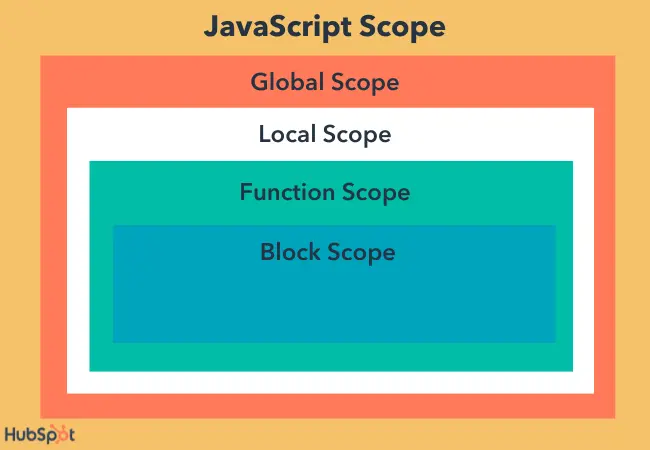
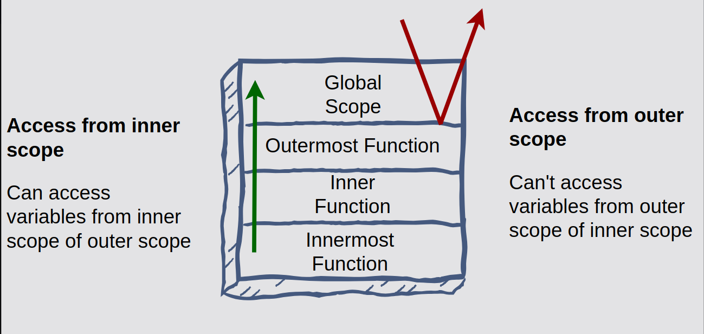

In JavaScript, scopes define the accessibility of variables and functions in different parts of the code. The two primary types of scopes are:

# Local Scope



**Variables declared inside a function or block are only accessible within that function or block.**

## 1. **Function Scope**

Variables declared within a function are only accessible within that function.
```js
function exampleFunction() {
  let localVar = "I am local to the function";
  console.log(localVar); // Accessible inside the function
}

exampleFunction();
// console.log(localVar); // Error: localVar is not defined
```
*In this example, `localVar` is defined inside the function `exampleFunction()`, so it is only accessible within that function. Trying to access it outside will result in an error.*

## 2. **Block Scope (with `let` and `const`)**

Variables declared inside a block (like inside an `if` or a `for` loop) are scoped to that block.
```js
if (true) {
  let blockVar = "I am local to this block";
  console.log(blockVar); // Accessible inside the block
} // console.log(blockVar); // Error: blockVar is not defined
```
*Here, `blockVar` is scoped to the `if` block, so trying to access it outside the block will result in an error.*

## 3. **Block Scope in Loops**

Variables declared inside a loop using `let` or `const` are local to the loop block.
```js
for (let i = 0; i < 3; i++) {
  let loopVar = `Loop iteration ${i}`;
  console.log(loopVar); // Accessible inside the loop block
} // console.log(loopVar); // Error: loopVar is not defined
```
*In this case, `loopVar` is only available inside the loop block. It is not accessible outside the loop.*

## 4. **Nested Function Scope**

Functions can be nested inside other functions, and variables declared in an outer function are accessible to the inner functions, but not vice versa.
```js
function outerFunction() {
  let outerVar = "I am from the outer function";
  
  function innerFunction() {
    let innerVar = 10
    console.log(outerVar); // Can access outerVar because innerFunction is inside outerFunction
  }
  innerFunction();
  console.log(innerVar); // Error: innerVar is not defined (innerVar is only accessible inside innerFunction)
}

outerFunction();
```
*Here, the inner function `innerFunction()` can access variables from the outer function, but the reverse is not true.*

## 5. **Local Scope and Closure**

A closure is when a function retains access to its lexical scope even after the function has returned.
```js
function outerFunction() {
  let outerVar = "I am from the outer function";
  
  return function innerFunction() {
    console.log(outerVar); // innerFunction still has access to outerVar
  };
}

const closureFunction = outerFunction();
closureFunction(); // "I am from the outer function"
```
*Even after `outerFunction` has finished executing, `innerFunction` still has access to `outerVar` because of the closure.*

___

# **Global Scope**

- Read [this](https://flexiple.com/javascript/global-variables) to know more about **Global variables** in `JS`.
- *Read [this](https://dev.to/rahulvijayvergiya/nodejs-vs-browser-understanding-the-global-scope-battle-39al) to know the differences between **Global** scope in **browser** and **`NodeJS`***

**Variables declared outside any function are accessible anywhere in the code.**

## 1. Global Scope in the Browser

There are two contexts to declare a variable in the Global scope in Browser.

### ***First Way**,* 
is to declare it Globally within a specific ***Module*** or a script, so it is isolated from the rest of the project files, not globally seen on the runtime of the current tab or environment of the browser.
- ***Modules*** in the browser are isolated, meaning that they don't directly interact with the global scope unless you explicitly import/export between them.

```html
<!-- HTML File -->
<script type="module">
  let x = 10;  // x is scoped to this module
  console.log(x);  // This will work inside the module
</script>

<script>
  console.log(x);  // Error: x is not defined in this global scope
</script>
```

### ***Second way**,*
Is to declare it Globally by attaching it to the `window` object which is a shared object across the environment that holds objects that meant to be shared globally across all the environment, and that is what meant by **Global Scope**, it is globally shared with every thing once it got set.  

> __Personally, i find this philosophy of `JS` of declaring a global object is weird, but i can accept due to where `JS` meant to be and work with.__

In the browser, the global scope is tied to the `window` object. This means any variable declared in the global scope without `let`, `const`, or `var` is added as a property of the `window` object.
```js
var globalVar = "I am global!";
console.log(window.globalVar);  // "I am global!"
```
