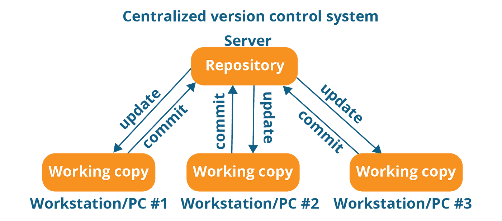

# Introduction to Git
Overview of Git and its importance in version control.

## Some Refs to read:

- [Centralized vs Distributed Version Control: Which One Should We Choose?](https://www.geeksforgeeks.org/centralized-vs-distributed-version-control-which-one-should-we-choose/)
- 

---

***`Git`*** is a version control program, and to know ***`Git`*** we must first define what is the Version Control Systems.

## What is a Version Control

**Version control** is a system that helps you track and manage changes to files over time. It’s like a history book for your project files, especially for source code in software development.

Imagine you’re writing a big document or coding a program with a team. Over time, you **make changes**, fix mistakes, **add** features, or sometimes accidentally **break things**.

**Version control helps you:**

- Save snapshots of your work regularly.
    
- See who changed what and when.
    
- Undo mistakes by going back to an earlier version.
    
- Work with others without overwriting each other’s changes.
    
- Manage multiple versions of the same project (branches).

## Before `Git`

Before ***`Git`*** was made the main stream of the version control were the **centralized version control systems**.

**What is Centralized Version Control (`CVCS`)?**

Centralized Version Control (`CVCS`) is a system where there is a central repository that stores all the code, and developers access this repository to make changes.

The Key Features of it:

- ***Single Central Repository***: All project files are stored in a central location, and every developer gets a copy of the latest version of the code.
  
- ***Version History***: The version history of the project is managed centrally, making it easy to track changes and revert to older versions.
  
- ***Real-Time Collaboration***: Developers can work on the same codebase, with access to the latest code and updates from others.

- ***Simple Setup:*** `CVCS` systems are relatively simple to set up and understand.

And While they worked well, they had some problems:

- If the central server went down, no one could save or retrieve code.
    
- Working offline was difficult.
    
- Merging changes from multiple developers was often slow and error-prone.

## History

In **2005**, the Linux kernel community needed a better tool for managing their code. Previously, they used a proprietary system called **`BitKeeper`**, which was free for open source but closed source. When the relationship between the Linux community and `BitKeeper` company soured, Linux needed a new tool — fast, distributed, and powerful enough to handle a huge number of changes.

**Linus Torvalds**, the creator of Linux himself, designed Git to meet these needs. The goal was to create:

- A **distributed system** where every developer has a full copy of the entire repository history.
    
- A tool that is **fast** and efficient, even with large projects.
    
- A system that supports **non-linear development** (multiple branches and merges).
    
- A way to ensure data integrity and reliability.

## How Git Worked?

Git stores data as a series of snapshots of the project’s files over time, rather than just differences (deltas). Each commit in Git is a snapshot with a unique identifier (SHA-1 hash) ensuring integrity.

Because each developer has the full history, work can continue even without a network connection, and syncing changes later is easy.

---

- [Continue to Sign-in policy....](Sign_in_Policy.md)
